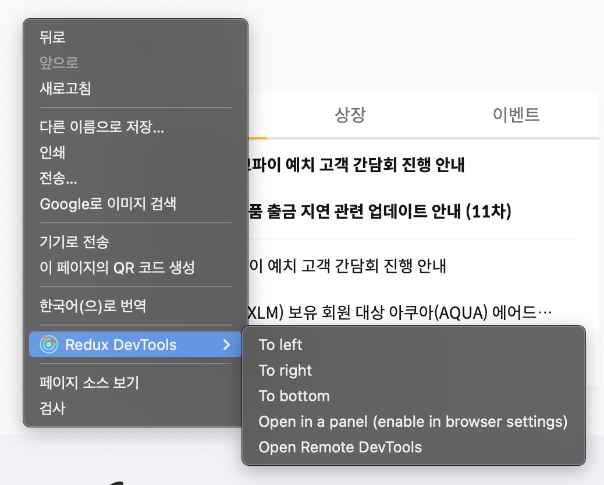

# Chrome extension


\- Edinburgh -

## ToC

- Chrome extension?
- User Interface
- Architecture
- Hello Extensions
- Examples
- Gopax Devtools

## Chrome extension?

웹 기술(HTML, CSS, JavaScript)를 사용해서 크롬 브라우저에 다양한 기능을 추가할 수 있는 브라우저 확장 프로그램.

브라우저 API 뿐 아니라 크롬 API를 함께 사용 가능.

> Chrome extensions enhance the browsing experience by adding features and functionality to the Chrome browser, providing things like:
>
> - Productivity tools.
> - Web page content enrichment.
> - Information aggregation.

## User Interface

### Action (w/ badge, popup, tooltip)

도구 모음에 표시되는 확장 프로그램의 아이콘으로 클릭시 팝업을 열거나 기능을 트리거 할 수 있음. 마우스 호버시 툴팁 표시됨.  
[chrome.action.setBadgeText()](https://developer.chrome.com/docs/extensions/reference/action#method-setBadgeText)로 아이콘 위에 badge 표시 가능.  
[DeclarativeContent API](https://developer.chrome.com/docs/extensions/reference/declarativeContent/)를 사용해서 URL에 따라 혹은 매칭되는 CSS selector가 있는 경우에만 활성화 할 수도 있음.


### Omnibox

[Omnibox API](https://developer.chrome.com/docs/extensions/reference/omnibox/)를 사용해 주소창 검색을 커스터마이징 할 수 있는 기능.  
주소창에 등록한 키워드가 입력되면 `omnibox`가 활성화되고, 사용자의 입력을 받아서 처리.


### Context menu

`"contextMenus"` 권한을 획득하고 [ContextMenus API](https://developer.chrome.com/docs/extensions/reference/contextMenus/)를 사용해서 추가.



### Commands

키 조합(단축키)을 바인딩해서 사용 가능

### Override Pages

북마크 관리자([chrome://bookmarks](chrome://bookmarks)), 히스토리([chrome://history](chrome://history)), 새탭([chrome://newtab](chrome://newtab)) 페이지 중 하나를 오버라이드 가능


### Notifications

`"notifications"` 권한을 획득하고 [Notification API](https://developer.chrome.com/docs/extensions/reference/notifications/)를 사용 가능


### Internationalize the UI

`_locales/` 폴더에 특정 언어 파일들을 만들어 두고 [I18n API](https://developer.chrome.com/docs/extensions/reference/i18n/)를 사용해서 여러 언어로 제공 가능

### Options

extension을 커스터마이징 할 수 있는 페이지를 제공할 수 있음.  
새탭으로 표시하거나 `chrome://extensions`에서 팝업 형태로 표시.


## Architecture


### Manifest (V3)

extension을 사용하기 위해 반드시 필요한 설정 파일(`manifest.json`)로 project의 최상위에 위치해야함.  
extension의 정보(버전, 이름, 아이콘 등) 뿐 아니라 extension에 필요한 `Chrome API`와 `권한`을 명시하고, extension을 구성하는 여러 파일들(service worker, content script, options page, popup 등)을 지정. ([manifest 전체 키 목록](https://developer.chrome.com/docs/extensions/mv3/manifest/))

```json
{
  "manifest_version": 3,
  "name": "My Extension",
  "version": "1.0.1"
  // ...
}
```

### Service Worker

브라우저가 백그라운드에서 실행하는 이벤트 기반 스크립트로 extension의 여러 부분의 작업을 관리하는 역할로 사용.  
[Extension API](https://developer.chrome.com/docs/extensions/reference/)는 사용 가능하지만 DOM API는 사용할 수 없고 페이지 컨텐츠를 직접 수정 불가능.

### Content Script

호스트 페이지에 코드를 주입하기 위해서 사용하는 스크립트.  
호스트 페이지와 동일한 DOM 트리에 접근 가능 하지만 별도의 자바스크립트 환경(변수 등이 충돌하지 않도록, 크롬 탭 처럼)에서 실행되고 일부 [Chrome API](https://developer.chrome.com/docs/extensions/reference/)에 접근 가능.  
[패턴](https://developer.chrome.com/docs/extensions/mv3/match_patterns/) 지정을 해서 스크립트가 실행될 웹사이트를 명시 가능.

### HTML Pages

extension에서 사용할 여러 HTML 파일들(popup, options 등)로 [Chrome API](https://developer.chrome.com/docs/extensions/reference/)에 접근 가능하지만 inline JavaScript는 사용 불가능하고 별도의 JavaScript 파일을 포함하도록 사용.

### Storing Data

extension에서 사용할 수 있는 [Storage API](https://developer.chrome.com/docs/extensions/reference/storage/)를 제공 (사용목적에 따라 4개의 영역이 존재)

- storage.local  
  local에 저장되고 extension 제거시 지워짐. 5MB 제한 이지만 `"unlimitedStorage"` 권한으로 증가 가능.
- storage.sync  
  동기화를 활성화화면 사용자가 로그인한 모든 chrome 브라우저에 동기화. 비활성화시 `storage.local`과 동일하게 동작. 전체는 약 100KB, 항목별 8KB 제한.
- storage.session  
  세션이 유지되는 동안 데이터를 메모리에 유지. 기본적으로 content script에서 접근 불가능하지만 설정 변경으로 가능. 약 10MB 제한.
- storage.managed  
  도메인 관리자가 설정하는 읽기전용 영역.

### Sending Message

content script 또는 다른 페이지들과 service worker간에 데이터를 주고 받아야 할 필요가 있음. (접근할 수 있는 영역이나 사용 가능한 API가 다르기 때문에)  
일회성으로 메세지를 보내거나, 연결을 유지하면서 메세지를 주고 받을 수 있음. (참고: [Message passing](https://developer.chrome.com/docs/extensions/mv3/messaging/))  
호스트 페이지와 content script 간에는 공유하고 있는 DOM을 통해 통신. (window.postMessage / window.addEventListener)

## Hello Extensions

### manifest.json

```json
{
  "manifest_version": 3,
  "name": "Hello Extensions",
  "description": "Base Level Extension",
  "version": "1.0",
  "action": {
    "default_popup": "hello.html",
    "default_icon": "hello_extensions.png"
  }
}
```

### hello.html

```html
<html>
  <body>
    <h1>Hello Extensions</h1>
  </body>
</html>
```

### Loading an unpacked extension

- `chrome://extension`에서 `개발자 모드` 활성화
- `압축해제된 확장 프로그램을 로드합니다.` 선택
- 변경 후 에는 새로고침


### Debugging

팝업에서 우클릭 - 검사 또는 액션 우클릭 - 팝업 검사  
에러가 발생하면 `chrome://extensions/`에 `오류(Errors)` 버튼이 나타나고 클릭시 정보 표시


## Examples

- Reading time  
  페이지의 단어수로 읽는데 걸리는 예상 시간을 계산해서 표시 (manifest, icon, content script, match pattern)
- Focus Mode  
  페이지의 스타일을 제거해서 읽기 쉽게 변경 (permission, service worker, action, badge, shortcut, insert css)
- Tabs manager  
  Chrome extension과 Chrome Web store 문서들이 열린 탭을 탭그룹으로 묶어줌 (popup, tabs, host permission)

## Gopax Devtools

### preview

[chrome-extension-boilerplate-react-vite](https://github.com/Jonghakseo/chrome-extension-boilerplate-react-vite)

기능

- web socket message formatter
- request w/primus helper
- feature flag


