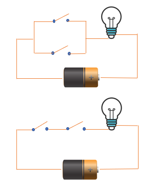
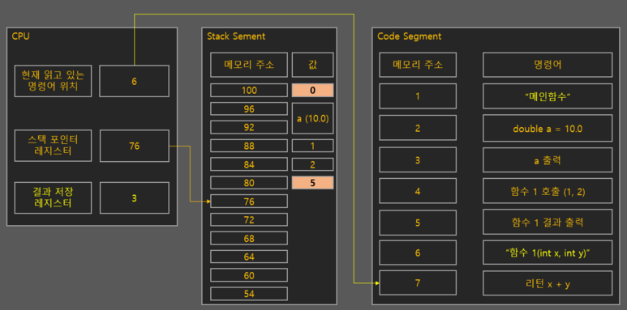
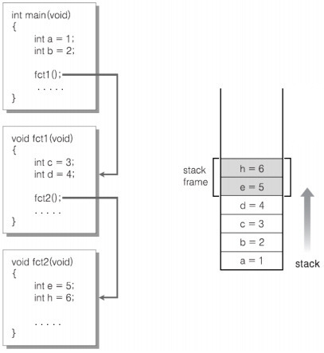
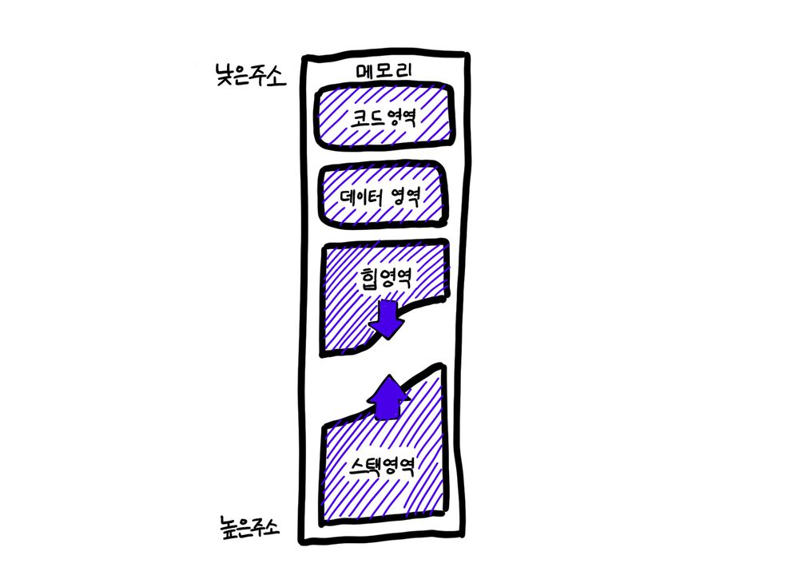
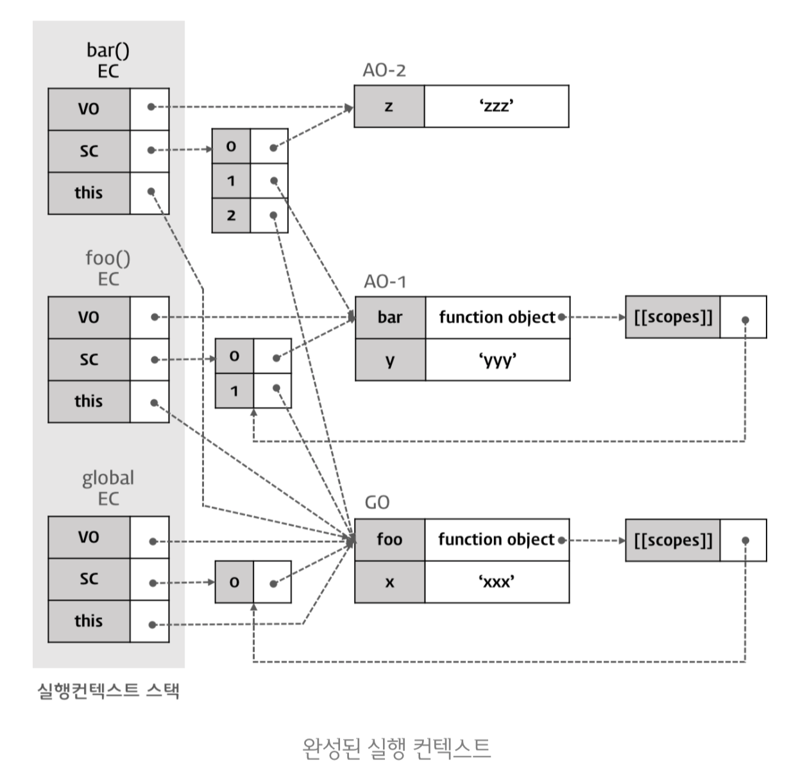

# 컴퓨터, 함수, 컴파일러 그리고 자바스크립트

\- Edinburgh -

## ToC

- 0과 1
- 서브루틴과 함수
- 컴파일러
- C언어
- 자바스크립트

## 0과 1

### 디지털 논리 회로

#### 전위차

두 지점 사이 전위(전기적 위치 에너지)의 차이

#### 스위치

Off - 0 (0V) / On - 1 (5V)

#### 논리회로

AND, OR, NOT, XOR, NOR, ADDER, COUNTER...



### CPU

입력(전위차 배열)과 내부상태(레지스터)를 사용해 출력(전위차 배열)을 만들어내는 조합논리회로의 일종  
출력을 통해 전위차 배열의 기억 기능을 가진 소자(ex. DRAM, 모니터) 내의 전위차 배열을 변경

#### 주소 시스템

메모리의 특정 지점의 전위차(데이터)를 접근하는 방법

#### PC (Program Counter) 레지스터

접근해야 할 메모리 주소를 저장 후 전달, 다음에 처리할 주소로 변경을 반복

### 코딩

인간이 인지하는 개념(0과 1)을 통해 기계가 처리할 수 있는 전기적 신호(0V와 5V)로 바꾸는 작업

#### 기계어

CPU가 직접 해독하고 실행할 수 있는 비트 단위로 쓰인 컴퓨터 언어 (CPU 종류에 따라 서로 다름)

```txt
// Load a value into register 8, taken from the memory cell 68 cells after the location listed in register 3
[  op  |  rs |  rt | address/immediate]
   35     3     8           68           decimal
 100011 00011 01000 00000 00001 000100   binary
```

#### 어셈블리어

기계어와 1대1로 대응되는 프로그래밍 언어
기계어 대신 사람이 알아보기 쉬운 연상 기호를 정해서 사용 (MOV, ADD 등)

## 서브루틴과 함수

### 기계어(어셈블리어)의 문제

- CPU 마다 제공하는 명령의 조합이 다름
- 동일한 CPU라 하더라도 같은 기능을 재사용하려는 경우 코드 복사 후 메모리 위치(주소)들의 변경이 필요  
  => 번거로움 + 메모리 낭비

### 서브루틴

PC 레지스터의 값을 변경(서브루틴 시작주소)하고 복귀할 주소값(메인루틴의 다음 주소)을 저장

#### 서브루틴의 문제

- 메인루틴과 서브루틴의 데이터 공유  
  => 공유에 사용할 메모리 주소를 미리 할당 후 사용
- 서브루틴에서만 사용되는 데이터
  => 서브루틴에서 사용할 메모리를 별도로 할당해서 사용
- 자기 자신을 호출(재귀) 하는 경우
  => 방법이 없음

> 메모리를 어떻게 잘(효율적으로) 사용할 것인가

### 스택 프레임

서브루틴의 가진 문제 + CPU 의존성을 한 번에 해결 (by 앨런튜링)

- 스택 프레임을 위한 일정 크기의 메모리 공간을 미리 정해둠
- SP(Stack Pointer) 레지스터에 이 메모리의 시작 주소나 마지막 주소를 저장하도록 메인 루틴에 작성 (현재 실행중인 스택 프레임)
- 서브루틴에서 넘겨 받는 데이터, 내부에서만 사용하는 데이터, 복귀할 메인 루틴의 주소등을 *SP에 저장된 주소에 대한 상대적인 위치*로 사용하고
- 서브루틴의 결과를 특정 레지스터에 저장하고 스택 포인터를 복귀주소로 설정
- 서브루틴을 호출 할 때 호출당하는 서브루틴이 사용할 메모리 공간의 크기만큼 스택 포인터를 증감

### 함수



`스택 프레임` 기법을 사용해서 작성한 `서브루틴`

## 컴파일러

### 자동화 프로그램

소스코드(ASCII)를 목적코드(기계어)로 변환

- 메모리 주소를 직접 사용하지 않도록 (`0x000100010` => `int a`)
- 사람이 알아보기 쉬운 명령어 (`ADD 1 2` => `1 + 2`)
- 정형화된 방식인 스택 프레임을 자동으로 처리

> 프로그래밍 (언어)을 배운다는 것은 컴파일러의 사용법을 배우는 것  
> (같은 언어라도 컴파일러 마다 동작이나 스펙이 다를 수 있음)

## C 언어



### 자료형 (이름 + 크기)

정수

```c
int a;  // a에 메모리 주소를 부여하고 int(4byte or 8byte) 크기 만큼의 공간을 할당하도록 컴파일러에게 알려줌
a = 10; // 할당된 메모리에 10을 저장하는 연산을 수행
```

포인터와 배열

```c
int a = 10;
int* b = &a; // b가 나타내는 메모리 공간에 담긴 값이 주소, 포인터를 사용하기 위해서는 초기화 필요
// b에서 4byte or 8byte 크기(포인터)의 만큼의 값을 읽고, 그 값을 주소로 부터 4byte or 8byte 크기(int)의 만큼의 값을 읽음
printf("$d\n", *b);
```

```c
int a[3]; // a => (int의 크기 * 3)의 크기를 가지는 메모리의 시작 주소(포인터), 초기화 필요 없음
```

### 함수

함수도 결국은 포인터

```c
int function1() {
    return 0;
}

int (* function2)();

function2 = function1;
function2();
```

> 함수의 크기는 정형화할 수 없음

함수 호출?  
PC 값을 그 주소로 변경 후 실행 (+ SP 변경, 복귀 주소 저장 등)

### 데이터 저장 방법



1. 코드/함수 => 코드 영역
2. 전역/정적 변수 => 데이터 영역
3. 지역/매개 변수 => 스택 영역
4. 동적 할당 => 힙 영역

### 사용자 정의 자료형

구조체

```c
typedef struct USERDATA {
    int age;
    char name[30];
    char phoneNo[30];
} USERDATA;

int main() {
  USERDATA user1; // 구조체 변수
  USERDATA* user2; // 구조체 포인터 변수
  user2 = (USERDATA *)malloc(sizeof(USERDATA));
  return 0;
}
```

> 클래스 : 객체 = 사용자 정의 자료형 : 구조체 포인터 변수

사용자 정의 자료형의 재사용(상속) 방법? 클래스의 복사, 객체의 복사

## 자바스크립트

### 자바스크립트 엔진 (ex. V8)

브라우저(or 노드) 프로세스의 스레드  
사전에 미리 하지만 않을 뿐 자바스크립트도 컴파일 언어

> (함수)실행 바로 직전에 컴파일레이션 한다. (w/ 최적화)
> 즉, 두 번의 공격이 있다. (컴파일레이션과 실행)

### 변수 선언

```js
// var a = 1;
var a; // 메모리를 사용하겠다. 그 이름은 a로 하겠다. => 컴파일러 => 스코프에 선언 (첫번째 공격)
a = 1; // 그 메모리에 1을 대입하라 => 실행 (두번째 공격)
```

- 실행이 아닌 해석하는 시점에 스코프를 결정 => 렉시컬 스코프 in 실행 컨텍스트
- 실행 전에 선언들을 먼저 처리 => 호이스팅
- 처리할 때 초기화 여부(var vs let/const) => TDZ
- 스코프는 중첩되고, 상위 스코프를 참조(스코프 체인) => 클로저 (함수 종료 후에도 유지하고 있는 스코프)

### 함수의 실행



- 스택 프레임 = 실행 컨텍스트
- 콜 스택 = 실행 컨텍스트 스택

### 자료형

객체인 것과 아닌 것

- `undefined`, `boolean`, `number`, `string`, `bigint`, `symbol`
- `object`(`null`, `function`)

### 사용자 정의 자료형은?

`class`가 나오기 전까지 불가능, 대신 기본 객체를 복사/수정

#### 객체

내장 객체 or 함수(내장 객체) 객체를 복사해서 수정한 객체

> `Object`도 함수 객체

#### 함수 객체

`constructor`객체를 가진 `prototype` 객체를 가지고 있는 객체

---

#### 새로운 함수(객체) 생성


- 함수 자체를 복사 후 수정  
  => `new`
- 복사 기능을 함수 내부에 포함  
  => `constructor`
- 복사(= 메모리 중복) 해결  
  => `prototype`, `__proto__`

## 끄읏
