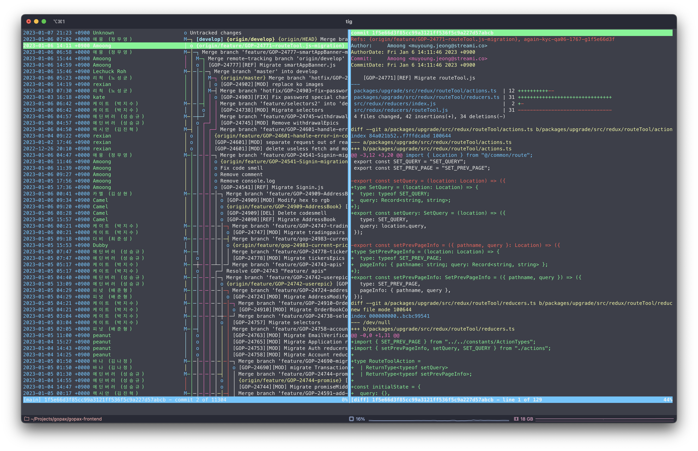

# CLI 생산성 향상하기


\- Edinburgh -

---

개발자라면 친해져야하는 터미널과 CLI(Command Line Interface).

GUI는 프로그램마다 사용법을 익혀야 하고 전환이 필요합니다. 키보드와 마우스를 번갈아 사용하는 번거로움도 있는데, CLI를 사용하면 전환없이 터미널에서 키보드만으로 빠르게 작업이 가능합니다. (잘만 쓴다면 `간zㅣ`는 덤)

하지만 GUI만큼 직관적이지 않아서 익숙해지기 까지 시간이 걸리고, 매번 필요한 커맨드를 외우고 입력해야 해서 불편함도 있습니다.

터미널에서 CLI를 편리하게 사용할 수 있는 팁(for Git)과 나만의 CLI를 직접 만드는 방법을 소개합니다.

> GUI/CLI 모두 장단점이 있기 때문에 어느 하나가 좋다기 보다 필요에 따라 GUI와 CLI를 잘 활용합시다.

## ToC

- Tips for Git
  - Git Alias
  - Git Hooks
  - Tig
  - Terminal
- Node.js로 CLI 만들기
  - without 라이브러리
  - with 라이브러리
  - 전역으로 설치하기
- Conclusion

## Tips for Git

### Git Alias

[[2.7 Git의 기초 - Git Alias](https://git-scm.com/book/ko/v2/Git%EC%9D%98-%EA%B8%B0%EC%B4%88-Git-Alias)]

Git 명령어들에 alias를 설정해서 간단하게 줄이거나, 여러 명령어를 한 번에 입력 가능

`git config` 사용

```bash
$ git config --global alias.co checkout
$ git config --global alias.br branch
$ git config --global alias.ci commit
$ git config --global alias.st status
```

Git 설정파일 직접 수정

글로벌 - `.gitconfig` or 로컬 - `.git/config`

### 축약

긴 명령어를 짤게 줄여서 사용

```bash
[alias]
    co = checkout
    branch-name = git rev-parse --abbrev-ref HEAD
    lg = log --pretty=format:'%Cred%h%Creset -%C(yellow)%d%Creset %s %Cgreen(%cr) %C(bold blue)<%an>%Creset' --abbrev-commit
    lgraph = log --graph --pretty=format:'%Cred%h%Creset -%C(yellow)%d%Creset %s %Cgreen(%cr) %C(bold blue)<%an>%Creset' --abbrev-commit
```

### 외부 명령어(shell script) 실행

alias 앞에 `!` 추가, 함수로 파라미터 받기 가능

```bash
[alias]
    branch-name = !git rev-parse --abbrev-ref HEAD
    publish = !git push -u origin $(git branch-name)
    ch = "!git checkout $(git branch -vv | grep -v '^\\*' | fzf | awk '{print $1}')"

    rb = !f() { git branch -D $(git branch | grep -E $1); }; f
```

### alias 목록 출력

```bash
[alias]
    alias = "!# Prints all aliases.;\n\
        git config --list \
        | egrep '^alias.+' \
        | sed -e 's/^alias\\.//' \
        | sed -e 's/^[^=]*=/\\'$'\\033[31m&\\033[(B\\033[m/' \
        | column -t -s'=' \
        | sed 's/!#* *//; s/;$//' \
        | cut -c1-85"
```

### Git Hooks

[8.3 Git맞춤 - Git Hooks](https://git-scm.com/book/ko/v2/Git%EB%A7%9E%EC%B6%A4-Git-Hooks)

Git의 특정 이벤트(`commit`, `push`등)가 생기면 스크립트를 실행하도록 지정 가능

#### hook 종류

`pre-commit`, `prepare-commit-msg`, `commit-msg`, `post-commit`, `applypatch-msg`, `pre-applypatch`, `post-applypatch`, `pre-rebase`, `post-rewrite`...

#### [husky](https://github.com/typicode/husky)

git hook을 좀 더 간단히 설정할 수 있음

### 예) prepare-commit-msg

커밋메세지에 지라 티켓을 자동으로 추가

```text
# [티켓번호][타입] 제목
######## 제목은 50자 이하로 ################# -> |
[TICKET-ID]
...
```

.git/hooks/prepare-commit-msg

```bash
#!/bin/sh

COMMIT_MSG_FILE=$1
ISSUE_ID_TAG='TICKET-ID'
branch_name=`git rev-parse --abbrev-ref HEAD`
issue_id=`echo ${branch_name} | sed -n 's/^.*\/\([a-zA-Z]*-[0-9]*\)[_|-].*/\1/p'`
if [ -n "$issue_id" ]; then
sed -i ".bak" "s/${ISSUE_ID_TAG}/${issue_id}/g" ${COMMIT_MSG_FILE}
fi
```

### Tig (text-mode interface for git)

Tig는 Git에 대한 ncurses 기반의 텍스트 모드 인터페이스로 작성되었습니다. Tig는 Git 저장소의 변화를 확인하고 추가적으로 다양한 Git 명령에 대한 출력 내용을 확인할 수 있는 pager로 사용할 수 있습니다. Pager로 사용할 경우, stdin에서 입력을 표시하고, 색상을 추가할 수 있습니다.



[(번역) Tig Manual](https://ujuc.github.io/2016/02/10/tig-manual/)

### 터미널

iTerm + zsh + oh-my-zsh (https://subicura.com/mac/dev/hello.html)
:

Fig (https://fig.io/)
: 기존 터미널에 통합해서 사용할 수 있는 커맨드 라인 도구

> The next-generation command line.

hyper (https://hyper.is/)
: 웹기술로 만들어진 터미널

> The goal of the project is to create a beautiful and extensible experience for command-line interface users, built on open web standards.

## Node.js로 CLI 만들기

### CLI를 만들게 된 계기

=> 임베디드 환경에서 terminal 위주로 작업 - 불편함 이만저만...  
=> 업무 관련 python 유틸리티 만들어서 사용 (버전관리, 지라관리, 배포요청, 설정 변경...)  
=> 불편함 추가 - checkout 하면서 브랜치 입력하기 귀찮음 (터미널 설정, 여러 버전의 checkout 스크립트)  
=> FE - Javascript(Node.js) 기반 CLI로 통합 해볼까? ...

#### 만들어볼 커맨드

`checkout` - 브랜치 리스트를 보여주고 선택하면 브랜치 변경

#### 필요한 기능

브랜치 목록 가져오기 / 브랜치 목록 보여주기 / 사용자 입력 받기 / 브랜치 변경하기

### without 라이브러리

#### `git` 커맨드를 node에서 실행하려면?

[childe_process](https://nodejs.org/dist/latest-v18.x/docs/api/child_process.html#child-process) 모듈 사용 (`spawn`, `exec`, `spawnSync`, `execSync`)

#### 사용자 입력을 받으려면?

[readline](https://nodejs.org/dist/latest-v18.x/docs/api/readline.html) 모듈 사용

#### console에 출력하는 글자색을 변경하고 싶다면?

https://stackoverflow.com/a/41407246

### with 라이브러리

[commander.js](https://github.com/tj/commander.js/) (or [oclif](https://oclif.io/))

> The complete solution for node.js command-line interfaces.

[inquirer.js](https://github.com/SBoudrias/Inquirer.js)

> A collection of common interactive command line user interfaces.

[shelljs](https://github.com/shelljs/shelljs)

> ShellJS is a portable (Windows/Linux/macOS) implementation of Unix shell commands on top of the Node.js API.

[chalk](https://github.com/chalk/chalk)

> Terminal string styling done right

### 전역으로 설치하기

#### packages.json

실행할 커맨드와 실행 파일을 연결

```json
"bin": {
    "c": "./dist/index.js",
    "checkout": "./dist/commands/checkout/index.js",
    "streami": "./dist/commands/streami/index.js"
  },
```

#### node로 실행

node로 실행할 수 있도록 파일 상단에 shebang 추가

```js
"#!/usr/bin/env node";
```

#### 설치

`npm i -g`

## Conclusion

Node.js를 사용하면,
+) 작성이 간단하고 많은 패키지들을 사용할 수 있어서 필요한 커맨드들을 금방 만들 수 있음  
-) 성능은 어느정도 감안해야하고, nvm/fnm 등을 설치했다면 버전마다 전역 설치 필요 (다른 언어로 바꿀까 고민 중...)

보통의 다른 프로그래밍 언어들로도 만들 수 있고 대부분 쉽게 만들게 도와주는 프레임워크나 가이드가 존재하기 때문에 각자 취향에 맞게 선택해서 만들 수 있습니다. 꼭 CLI를 직접 만들지 않더라도 각자의 생산성을 위한 방법을 찾아서 해피 코딩을 해봅시다~!
